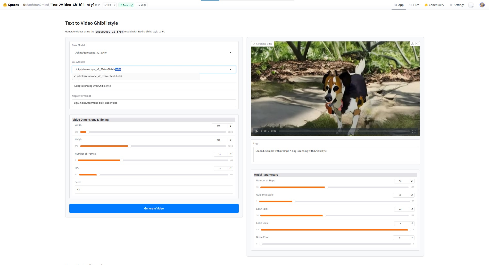
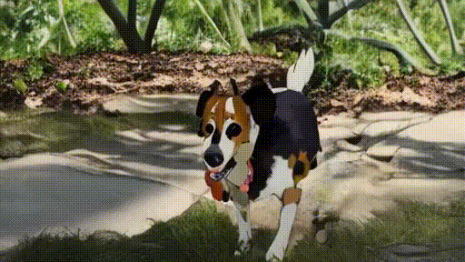
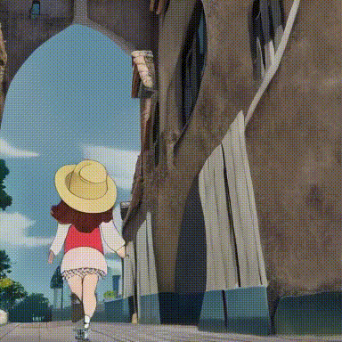
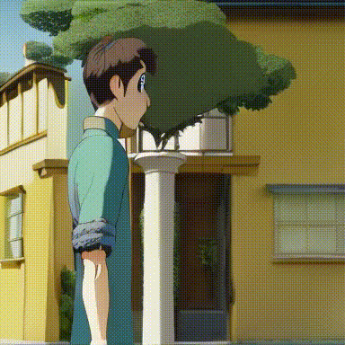
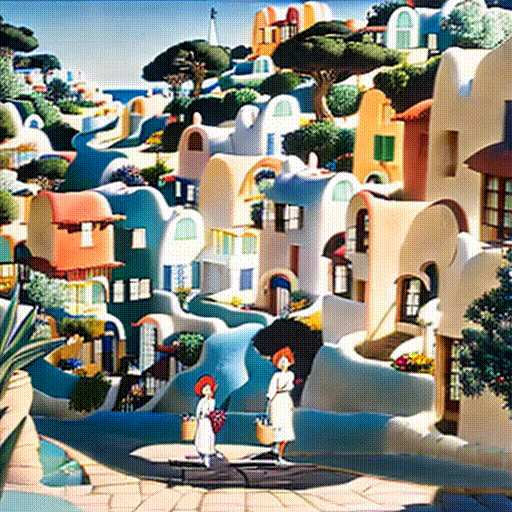

# Text to Video Ghibli style 🎞️ (Text2Video-Ghibli-style)

[](https://github.com/danhtran2mind/Text2Video-Ghibli-style/stargazers)


[](https://huggingface.co/docs/hub)
[](https://huggingface.co/docs/accelerate)
[](https://pytorch.org/)
[](https://huggingface.co/docs/transformers)
[](https://pytorch.org/vision/stable/index.html)
[](https://huggingface.co/docs/diffusers)
[](https://gradio.app/)
[](https://opensource.org/licenses/MIT)

## Introduction
Transform text into captivating videos with the enchanting aesthetic of Studio Ghibli. This project leverages a fine-tuned `zeroscope_v2_576w` model to generate high-quality, Ghibli-inspired video content from text prompts. Built upon the foundation of [MotionDirector](https://github.com/showlab/MotionDirector), it includes optimized code and enhanced stability for seamless performance. 🌟

## Key Features
- 🎨 Generate videos in the iconic Studio Ghibli art style
- ⚡ Optimized for efficiency with fine-tuned zeroscope_v2_576w
- 🛠️ User-friendly notebooks for training and inference
- 🌐 Interactive Gradio demo for real-time video generation
- 🔧 Enhanced stability and performance over the original MotionDirector

## Notebook
Explore the project with our comprehensive notebook: 
### Training Notebook:

[](https://colab.research.google.com/github/danhtran2mind/Text2Video-Ghibli-style/blob/main/notebooks/zeroscope_v2_576w_Ghibli_LoRA-Training.ipynb)
[](https://studiolab.sagemaker.aws/import/github/danhtran2mind/Text2Video-Ghibli-style/blob/main/notebooks/zeroscope_v2_576w_Ghibli_LoRA-Training.ipynb)
[](https://deepnote.com/launch?url=https://github.com/danhtran2mind/Text2Video-Ghibli-style/blob/main/notebooks/zeroscope_v2_576w_Ghibli_LoRA-Training.ipynb)
[](https://mybinder.org/v2/gh/danhtran2mind/Text2Video-Ghibli-style/main?filepath=notebooks/zeroscope_v2_576w_Ghibli_LoRA-Training.ipynb)
[](https://console.paperspace.com/github/danhtran2mind/Text2Video-Ghibli-style/blob/main/notebooks/zeroscope_v2_576w_Ghibli_LoRA-Training.ipynb)
[](https://mybinder.org/v2/gh/danhtran2mind/Text2Video-Ghibli-style/main)
[](https://github.com/danhtran2mind/Text2Video-Ghibli-style/blob/main/notebooks/zeroscope_v2_576w_Ghibli_LoRA-Training.ipynb)
[](https://www.kaggle.com/notebooks/welcome?src=https%3A%2F%2Fgithub.com%2Fdanhtran2mind/Text2Video-Ghibli-style/blob/main/notebooks/zeroscope_v2_576w_Ghibli_LoRA-Training.ipynb)

### Inference Notebook:

[](https://colab.research.google.com/github/danhtran2mind/Text2Video-Ghibli-style/blob/main/notebooks/zeroscope_v2_576w_Ghibli_LoRA-Inference.ipynb)
[](https://studiolab.sagemaker.aws/import/github/danhtran2mind/Text2Video-Ghibli-style/blob/main/notebooks/zeroscope_v2_576w_Ghibli_LoRA-Inference.ipynb)
[](https://deepnote.com/launch?url=https://github.com/danhtran2mind/Text2Video-Ghibli-style/blob/main/notebooks/zeroscope_v2_576w_Ghibli_LoRA-Inference.ipynb)
[](https://mybinder.org/v2/gh/danhtran2mind/Text2Video-Ghibli-style/main?filepath=notebooks/zeroscope_v2_576w_Ghibli_LoRA-Inference.ipynb)
[](https://console.paperspace.com/github/danhtran2mind/Text2Video-Ghibli-style/blob/main/notebooks/zeroscope_v2_576w_Ghibli_LoRA-Inference.ipynb)
[](https://mybinder.org/v2/gh/danhtran2mind/Text2Video-Ghibli-style/main)
[](https://github.com/danhtran2mind/Text2Video-Ghibli-style/blob/main/notebooks/zeroscope_v2_576w_Ghibli_LoRA-Inference.ipynb)
[](https://www.kaggle.com/notebooks/welcome?src=https%3A%2F%2Fgithub.com%2Fdanhtran2mind/Text2Video-Ghibli-style/blob/main/notebooks/zeroscope_v2_576w_Ghibli_LoRA-Inference.ipynb)


## Dataset
You can explore more in this HuggingFace Dataset available at the given link for further details: [](https://huggingface.co/datasets/raymondt/ghibi_t2v).

The model is trained on a curated dataset inspired by Studio Ghibli's visual style, ensuring authentic and high-quality video outputs. Details are available in the [dataset processing script](scripts/process_dataset.py). 📊

## Base Model
This project builds upon the `zeroscope_v2_576w` model, fine-tuned with LoRA for Ghibli-style video generation, forked from [MotionDirector](https://github.com/showlab/MotionDirector). 🚀

## Demonstration
Experience the magic of Ghibli-style video generation:  
- **HuggingFace Space**: [](https://huggingface.co/spaces/danhtran2mind/Text2Video-Ghibli-style)

- **Demo GUI**:  
  

To run the Gradio app locally (`localhost:7860`):  
```bash
python apps/gradio_app.py
```

## Usage Guide

### Setup Instructions

#### Step 1: Clone the Repository
Clone the project repository and navigate to the project directory:
```bash
git clone https://github.com/danhtran2mind/Text2Video-Ghibli-style.git
cd Text2Video-Ghibli-style
```

#### Step 2: Install Dependencies
Install the required Python packages:
```bash
pip install -r requirements/requirements.txt
```

#### Step 3: Configure the Environment
Run the following scripts to set up the project:
- **Install Third-Party Dependencies**  
  ```bash
  python scripts/setup_third_party.py
  ```
- **Download Model Checkpoints**  
  ```bash
  python scripts/download_ckpts.py
  ```
- **Prepare Dataset (Optional, for Training)**  
  ```bash
  python scripts/process_dataset.py
  ```

### Training
- To train the model:
```bash
python src/text2video_ghibli_style/train.py
```
- Training Hyperparameters
Refer to the [Training Documents](docs/training/training_doc.md) for detailed hyperparameters used in fine-tuning the model. ⚙️

### Inference
To generate videos using the trained model:
```bash
python src/text2video_ghibli_style/inference.py
```

## Inference Samples

<table>
  <thead>
    <tr>
      <th>Prompt</th>
      <th>Video</th>
    </tr>
  </thead>
  <tbody>
    <tr>
      <td style="text-align: center;">A dog is running with Ghibli style</td>
      <td style="text-align: center;"></td>
    </tr>
    <tr>
      <td style="text-align: center;">A girl is walking with Ghibli style</td>
      <td style="text-align: center;"></td>
    </tr>
    <tr>
      <td style="text-align: center;">Studio Ghibli style. Young man contemplates, walks away from ivy-covered yellow building.</td>
      <td style="text-align: center;"></td>
    </tr>
    <tr>
      <td style="text-align: center;">Studio Ghibli style. Two women walk down coastal village path toward sea, passing colorful houses, sailboats visible.</td>
      <td style="text-align: center;"></td>
    </tr>
  </tbody>
</table>

## Environment
- **Python**: 3.10 or higher
- **Key Libraries**: See [requirements_compatible.txt](requirements/requirements_compatible.txt) for compatible versions
<!-- 
## Contact
For questions or issues, please use the [GitHub Issues tab](https://github.com/danhtran2mind/Text2Video-Ghibli-style/issues) or the [Hugging Face Community tab](https://huggingface.co/spaces/danhtran2mind/Text2Video-Ghibli-style/discussions). 📬 -->

## Project Description

This repository is trained from [](https://github.com/danhtran2mind/MotionDirector), a fork of [](https://github.com/showlab/MotionDirector), with numerous bug fixes and rewritten code for improved performance and stability. You can download the `zeroscope_v2_576w` model from the [](https://huggingface.co/cerspense/zeroscope_v2_576w). Explore more models on [](https://huggingface.co/cerspense).
